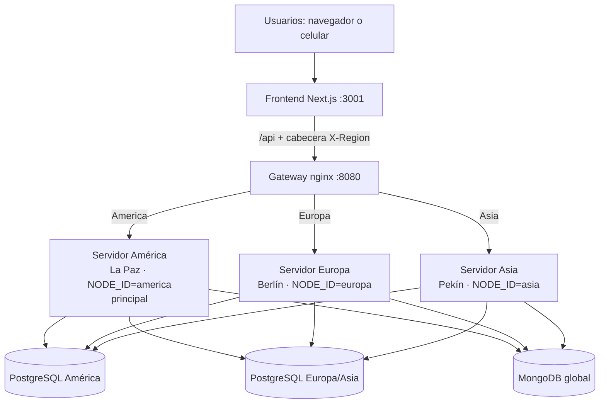
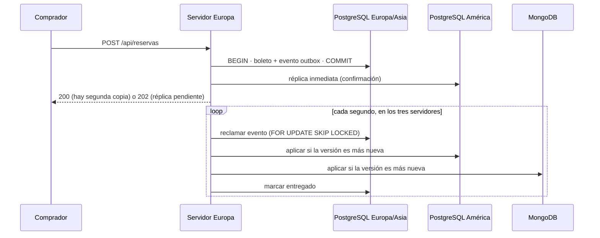

# Arquitectura distribuida y estrategia de sincronización

**Aerolíneas Rafael Pabón — Práctica 3: Sincronización de procesos distribuidos**

Este documento describe cómo está construido el sistema de reservas, cómo se mantienen consistentes las tres bases de datos y qué ocurre cuando falla un componente. Las cifras citadas provienen del [registro de pruebas](evidencia/registro-de-pruebas.txt).

## 1. Visión general

El sistema tiene **tres servidores de aplicación** en zonas horarias distintas y **tres bases de datos**. Cualquier servidor puede reservar, vender y anular boletos.



| Componente | Tecnología | Puerto | Función |
|---|---|---|---|
| `frontend` | Next.js 14 | 3001 | Interfaz en español e inglés. Reenvía `/api` al gateway. |
| `gateway` | nginx | 8080 | Envía cada petición al servidor de la región del comprador y, si no responde, a otro. |
| `backend_am` | Go · `America/La_Paz` | 8091 | Servidor América. Es el **principal**: hace la importación y el mantenimiento. |
| `backend_eu` | Go · `Europe/Berlin` | 8092 | Servidor Europa. |
| `backend_as` | Go · `Asia/Shanghai` | 8093 | Servidor Asia. |
| `postgres_am` | PostgreSQL 16 | 5432 | Base regional de América; guarda también una réplica completa. |
| `postgres_eu` | PostgreSQL 16 | 5435 | Base regional de Europa/Asia; guarda también una réplica completa. |
| `mongodb` | MongoDB 7 | 27017 | Proyección global de lectura. No acepta reservas. |

Cada servidor tiene su propio reloj de Lamport y su propia componente en el reloj vectorial. `GET /api/cluster` muestra la hora local y los relojes de los tres servidores; la pantalla **Sincronización** los presenta en vivo.

## 2. Enrutamiento y réplicas de datos

### 2.1 Qué servidor atiende cada petición

El frontend envía la cabecera `X-Region` (América, Europa o Asia) según el país elegido. El gateway la usa para escoger el servidor:

| Región del comprador | Servidor principal | Respaldo, en orden |
|---|---|---|
| America | América | Europa, Asia |
| Europa | Europa | Asia, América |
| Asia | Asia | Europa, América |

Si un servidor no responde, nginx reenvía la petición al siguiente. Las compras (`POST`) solo se reenvían cuando el servidor caído nunca recibió la petición, así una compra no se procesa dos veces. La importación de datos (`/api/entradas`) siempre va al servidor principal.

### 2.2 Dónde se guardan los datos

- **Vuelos.** Cada vuelo pertenece a la base de la región de su aeropuerto de origen. Los identificadores menores que 1.000.000.000 son de América; los demás, de Europa/Asia. La otra base guarda una copia.
- **Boletos.** Se escriben primero en la base de la región de la capital de compra (`America/*` → PostgreSQL América; Europa, Asia, África y Oceanía → PostgreSQL Europa/Asia). Si esa base no está disponible, se usa la otra.
- **MongoDB.** Guarda una copia global que se usa para leer cuando falla una base regional.

**Orden de lectura.** Primero la base de la región del usuario; si no responde, MongoDB; si tampoco responde, la otra base.

## 3. Estrategia de sincronización

### 3.1 Cola de eventos (patrón outbox)

Toda operación que cambia un dato (crear un vuelo, comprar, reservar, anular o liberar un asiento) hace dos escrituras **en la misma transacción**:

1. el registro nuevo o modificado;
2. un evento en la tabla `sync_outbox`, con el registro completo, su reloj de Lamport, su reloj vectorial y el servidor que lo generó.

Como ambas escrituras son atómicas, no puede existir un cambio sin su evento ni un evento sin su cambio.



Los tres servidores procesan la cola de las dos bases. Para no repartir el mismo evento dos veces, cada servidor lo **reclama** con `SELECT … FOR UPDATE SKIP LOCKED` y le asigna un tiempo de reserva de 30 segundos. Si la entrega falla, el evento se reintenta con una espera creciente (2 s, 4 s, …, hasta 60 s) hasta que ambas bases PostgreSQL y MongoDB lo reciban. La cola es persistente: un reinicio no pierde eventos.

Una compra responde **HTTP 200** cuando el boleto ya existe en las dos bases PostgreSQL. Si la segunda base no estaba disponible, responde **HTTP 202** con `replication_pending: true`, y la cola termina la entrega después.

### 3.2 Relojes de Lamport

Cada servidor tiene un contador (`services/lamport_service.go`):

- **Evento local** (compra, anulación, cambio de estado): `L = L + 1`.
- **Evento recibido o versión leída**: `L = max(L, L_recibido) + 1`.

Cada registro guarda el valor con que se escribió (`lamport_clock`). Al iniciar, el servidor recupera el valor más alto guardado en la cola, para que el reloj nunca retroceda.

### 3.3 Relojes vectoriales

Cada servidor tiene un vector con una componente por servidor, por ejemplo `{"america": 1628, "asia": 10, "europa": 11}` (`services/vector_service.go`):

- **Evento local**: el servidor incrementa **su propia** componente.
- **Antes de modificar un registro existente**: el servidor **combina** su vector con el del registro, tomando el máximo por componente (`ObserveClock`). Así, la versión nueva queda marcada como posterior a la versión que leyó.
- **Al entregar un evento** de la cola: el servidor combina el vector del evento con el suyo.

Con estas reglas el vector distingue dos situaciones que Lamport no puede separar:

- **A ocurrió antes que B**: cada componente de A es menor o igual que la de B, y al menos una es menor.
- **A y B son concurrentes**: ninguno de los dos cumple la condición anterior respecto del otro.

En las pruebas, el boleto `1000000031` del servidor Asia tiene el vector `{"america":1622,"asia":14,"europa":10}` y el boleto `1000000030` del servidor Europa tiene `{"america":1622,"asia":7,"europa":16}`. Ninguno domina al otro: son compras concurrentes hechas en servidores distintos.

### 3.4 Resolución de conflictos

Cuando un evento llega a una base que ya tiene ese registro, `ShouldApplyVersion` decide qué versión conservar:

1. Si el vector del evento **domina** al de la base, se aplica: es causalmente posterior.
2. Si el vector de la base domina al del evento, se descarta: el evento llegó tarde.
3. Si son **concurrentes**, gana el mayor reloj de Lamport y, si empatan, el mayor identificador de servidor.

El desempate es determinista, así que las tres bases terminan con la misma versión sin importar en qué orden reciban los eventos.

## 4. Control de concurrencia: evitar la doble reserva

Un mismo asiento puede intentar venderse desde dos servidores distintos que escriben en bases distintas. Un bloqueo de fila en una sola base no alcanza, porque el otro comprador escribe en la otra base. La compra aplica cinco controles:

1. **Bloqueo distribuido por vuelo.** `pg_advisory_lock` en la base dueña del vuelo (`db/flight_lock.go`). Los tres servidores usan la misma base para el mismo vuelo, así que las compras de ese vuelo se hacen de a una en todo el sistema. Si el servidor que tiene el bloqueo se cae, PostgreSQL cierra su sesión y libera el bloqueo.
2. **Bloqueo de la fila del vuelo** (`SELECT … FOR UPDATE`) dentro de la transacción de compra.
3. **Revisión de ocupación**: el asiento no puede estar en el manifiesto de ocupación ni tener un boleto activo en **ninguna** de las dos bases.
4. **Índice único** `unique_active_seat` sobre `(id_vuelo, id_asiento)` para los estados `RESERVED`, `SALED` y `REFUNDED`: como última defensa, la base rechaza un segundo boleto activo.
5. **Validación de reglas**: el vuelo debe estar programado o retrasado, no puede haber salido y el asiento debe ser del avión asignado.

Si el asiento ya está ocupado, el servidor responde **HTTP 409** con `asiento_ocupado`.

**Resultado de la prueba.** Se compraron 20 asientos, cada uno por tres compradores simultáneos, uno en cada servidor. Hubo 20 ventas y 40 rechazos, con compras guardadas en las dos bases y **ningún asiento vendido dos veces**.

## 5. Reglas del sistema

| Regla de la consigna | Implementación |
|---|---|
| Los vuelos con fecha posterior a la actual pasan a `SCHEDULED` | Antes de guardar cada vuelo importado se calcula su estado desde la hora programada: futuro → `SCHEDULED`, en curso → `IN_FLIGHT`, terminado → `LANDED`. Un vuelo futuro no puede cambiarse manualmente a otro estado. |
| Los aviones no aparecen mágicamente en otro aeropuerto | Ver sección 6. |
| `REFUNDED` → `AVAILABLE` tarda 15 min (configurable) | Al anular, el boleto pasa a `REFUNDED` con `available_at = ahora + REFUND_DELAY_MINUTES`. Un proceso de fondo libera el asiento al vencer el plazo y el cambio se propaga por la cola. |
| 73 % vendidos (configurable) y 3 % reservados | Cada vuelo tiene un manifiesto de ocupación generado de forma determinista. `PERCENTAGE_SOLD` y `PERCENTAGE_RESERVED` definen los porcentajes; al cambiarlos, los manifiestos se regeneran. |
| Flota y asientos por modelo | 6 A380 (10 + 439), 18 B777 (10 + 300), 11 A350 (12 + 250), 15 B787 (8 + 220). |

**Consistencia eventual en las devoluciones.** Durante los 15 minutos de espera, el asiento figura como `REFUNDED` en las tres bases y no se puede vender. Al vencer el plazo, uno de los servidores lo libera en la base dueña y el cambio llega a las demás por la cola. Mientras tanto, las bases pueden mostrar estados distintos, pero terminan coincidiendo.

## 6. Continuidad de los aviones

**El problema.** El dataset tiene 60.000 filas en 47 días (del 15/09 al 31/10) para solo 50 aviones, y todas las salidas son desde cinco ciudades (DXB, TYO, LON, PEK y ATL). Un avión que aterriza en cualquiera de las otras diez ciudades no tiene en el CSV ningún vuelo para salir de ahí. Aceptar esas filas tal cual significa que los aviones "aparecen mágicamente" en otro aeropuerto.

**La solución.** La importación (`AssignAircraft` en `data/flight_schedule.go`) recorre los vuelos en orden cronológico y asigna a cada uno el primer avión que cumpla alguna de estas condiciones:

1. Es el avión que indica el CSV y ya está libre en el aeropuerto de origen.
2. Es otro avión que está esperando en ese aeropuerto.
3. Es un avión que todavía no voló, por lo que se ubica ahí por primera vez.
4. Puede llegar a tiempo con un **vuelo vacío de reposicionamiento**, sin pasajeros ni venta, por una ruta existente en la matriz de tiempos.

Si ningún avión cumple, el vuelo se rechaza.

**El resultado.** Se aceptan 1.614 vuelos físicamente posibles y se programan 1.087 reposicionamientos, guardados en las tres bases. El diagnóstico `GET /api/diagnostico/continuidad` informa **0 saltos y 0 superposiciones**. De las 60.000 filas, 31.745 se rechazan por la ruta (no tiene precio en la matriz, el aeropuerto no está en el catálogo o el origen es igual al destino) y el resto por falta de un avión disponible.

## 7. Algoritmos

- **Rutas sugeridas (Dijkstra).** El algoritmo de Yen para las *k* rutas más cortas usa Dijkstra en cada iteración y devuelve las 3 mejores rutas entre dos aeropuertos, minimizando el costo (en clase turística o primera) o el tiempo. Una ruta sin precio en la clase elegida se considera inexistente.
- **Agente viajero (TSP).** Programación dinámica de Held-Karp, que es exacta, con complejidad O(n²·2ⁿ) y un máximo de 15 ciudades. Optimiza el costo o el tiempo y puede exigir el regreso al origen. Se comparó con una búsqueda exhaustiva en 80 casos al azar, sin ninguna diferencia.

## 8. Tolerancia a fallos

| Falla | Comportamiento | Verificado |
|---|---|---|
| Cae un servidor de aplicación | El gateway envía sus peticiones a otro servidor. La cola y las devoluciones siguen funcionando en los otros dos. | Asia caído: sus compras las atendió Europa. |
| Cae una base PostgreSQL | Las lecturas usan MongoDB o la otra base. Las compras se guardan en la otra base. `/api/health` informa `degraded`. | Europa/Asia caída: compra guardada en PostgreSQL América. |
| Se recupera una base | La cola entrega los eventos pendientes y un reconciliador copia los registros faltantes. | Tras recuperarla: 47 boletos en las tres bases, 0 pendientes. |
| Cae MongoDB | Las lecturas usan las bases PostgreSQL. La proyección se reconstruye al volver. | Probado durante el desarrollo. |
| Se reinicia un servidor | Los relojes se restauran desde la cola persistente y los eventos pendientes se reintentan. | — |

## 9. Límites conocidos

- **Partición de red con dos bases activas.** Si las dos bases PostgreSQL dejan de verse pero siguen aceptando escrituras, el bloqueo distribuido pasa a la base que cada servidor alcance y no se garantiza la exclusión mutua. Es el compromiso del teorema CAP: este sistema prioriza la disponibilidad y resuelve los conflictos después. Garantizar la consistencia estricta durante una partición requeriría un protocolo de consenso (Raft o Paxos) o un servicio de reservas con quórum.
- **Mantenimiento centralizado.** La importación, la reconciliación y la reconstrucción de MongoDB las hace solo el servidor principal. Si ese servidor cae, las ventas y la sincronización continúan, pero estas tareas esperan a que vuelva.
- **Gateway único.** El gateway es un único contenedor. En producción se duplicaría detrás de una IP compartida o de un balanceador de DNS.

## 10. Cómo ejecutar y verificar

```bash
docker compose up -d --build
# Interfaz: http://localhost:3001 · Estado: http://localhost:8080/api/health · Relojes: http://localhost:8080/api/cluster

docker compose stop backend_eu    # simular la caída de un servidor
docker compose stop postgres_eu   # simular la caída de una base
docker compose start backend_eu postgres_eu
```

**Despliegue en tres computadoras.** La carpeta `distribuido/` tiene un archivo Compose por PC (América, Europa y Asia) conectadas por Tailscale. Cada servidor usa las IPs de la red privada para alcanzar las bases de las otras PCs, y el servidor principal espera a que ambas bases PostgreSQL estén disponibles antes de importar. La guía está en [../distribuido/GUIA.md](../distribuido/GUIA.md).

La evidencia de funcionamiento está en [evidencia-funcionamiento.md](evidencia-funcionamiento.md).
