# Evidencia de funcionamiento

**Aerolíneas Rafael Pabón — Práctica 3**

Todas las pruebas se ejecutaron el 26/09/2026 sobre el sistema completo en Docker: tres servidores de aplicación, el gateway, dos bases PostgreSQL y MongoDB. La salida completa está en [evidencia/registro-de-pruebas.txt](evidencia/registro-de-pruebas.txt). La arquitectura se explica en [arquitectura-distribuida.md](arquitectura-distribuida.md).

## Resumen de resultados

| # | Requisito | Prueba | Resultado |
|---|---|---|---|
| 1 | 3 servidores distribuidos | `/api/cluster` desde el gateway | ✅ América (La Paz, UTC-4), Europa (Berlín, UTC+2) y Asia (Pekín, UTC+8), los tres `UP` |
| 2 | 3 bases sincronizadas | `/api/health` y `/api/sync/status` | ✅ 3 bases `UP`; los conteos de vuelos y boletos coinciden y la cola está vacía |
| 3 | Enrutamiento por región | Cabecera `X-Region` en el gateway | ✅ Cada región la atiende su propio servidor |
| 4 | Prevención de doble reserva | 20 asientos, 3 compradores simultáneos por asiento (uno por servidor) | ✅ 20 ventas, 40 rechazos (HTTP 409), **0 asientos vendidos dos veces** |
| 5 | Relojes de Lamport y vectoriales | Relojes de los servidores y de los boletos | ✅ Vectores de 3 componentes; se observan compras concurrentes |
| 6 | `REFUNDED` → disponible en 15 min | Compra y anulación | ✅ `REFUNDED` en las dos bases, liberación programada a los 15,0 min |
| 7 | Tolerancia a fallos: servidor caído | `docker compose stop backend_as` | ✅ Las compras de Asia las atendió otro servidor; volvieron a Asia al recuperarlo |
| 8 | Tolerancia a fallos: base caída | `docker compose stop postgres_eu` | ✅ Estado `degraded`, compra guardada en la otra base; tras recuperarla, 47 boletos en las 3 bases y 0 pendientes |
| 9 | Vuelos futuros en `SCHEDULED` | Estados de los vuelos importados | ✅ 1.177 `SCHEDULED` (futuros) y 437 `LANDED` (pasados) |
| 10 | Aviones sin "aparecer mágicamente" | `/api/diagnostico/continuidad` | ✅ 0 saltos y 0 superposiciones en 1.614 vuelos, con 1.087 reposicionamientos |
| 11 | 73 % vendidos y 3 % reservados | Panel de un vuelo (310 asientos) | ✅ 74,8 % vendidos y 2,9 % reservados: 73 % y 3 % del manifiesto más las compras hechas en pruebas anteriores |
| 12 | Dijkstra (3 mejores rutas) | TYO → ATL por costo y por tiempo | ✅ $1.400 directo; alternativas de $2.150 y $2.180 |
| 13 | TSP por costo y por tiempo | Comparación con búsqueda exhaustiva | ✅ 80 casos al azar, 0 diferencias |
| 14 | Rendimiento | 300 compras concurrentes repartidas entre los 3 servidores | ✅ 136 compras por segundo, todas aceptadas |
| 15 | Pruebas automáticas | `go test ./...` ([salida](evidencia/pruebas-automaticas.txt)) | ✅ 34 pruebas aprobadas, 0 fallidas |

## Relojes vectoriales observados

Últimos boletos al terminar la prueba de concurrencia (servidor que lo creó · Lamport · vector):

| Boleto | Servidor | Lamport | Vector |
|---|---|---|---|
| 13 | america | 4507 | `{"america":1628,"asia":10,"europa":11}` |
| 1000000031 | asia | 4505 | `{"america":1622,"asia":14,"europa":10}` |
| 1000000030 | europa | 4501 | `{"america":1622,"asia":7,"europa":16}` |

Los boletos `1000000031` (Asia) y `1000000030` (Europa) son **concurrentes**: cada uno tiene una componente mayor que el otro (`asia` 14 frente a 7 y `europa` 10 frente a 16). Ninguno de los dos servidores había visto la compra del otro. El reloj de Lamport por sí solo no permite detectar esta situación.

## Archivos de pasajes

Generados con el botón **Descargar boleto visual (PDF)** de la aplicación, a partir de tres compras hechas cada una desde un servidor distinto ([detalle](evidencia/compras-de-muestra.txt)):

| Pasajero | Servidor | Vuelo | Asiento | Archivo |
|---|---|---|---|---|
| María Fernanda Rojas | América | AP-1100019481 PEK → DXB | 2C · Primera | [Boleto_8.pdf](pasajes/Boleto_8.pdf) |
| Hans Müller | Europa | AP-1100001728 LON → MAD | 5F · Turística | [Boleto_1000000015.pdf](pasajes/Boleto_1000000015.pdf) |
| 李明 Li Ming | Asia | AP-1100047003 LON → AMS | 5A · Turística | [Boleto_1000000016.pdf](pasajes/Boleto_1000000016.pdf) |

También se incluye el pase de Wallet del primer boleto: [Boleto_8_wallet.pkpass](pasajes/Boleto_8_wallet.pkpass). Contiene `pass.json` (estilo `boardingPass`), iconos y `manifest.json`. Es un pase de demostración sin firma: Apple Wallet oficial exige un certificado de emisor, pero las billeteras de terceros que aceptan pases sin firma pueden importarlo.

## Capturas

### Panel general y tablero de salidas
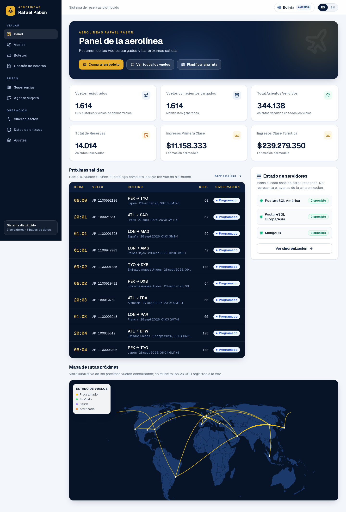

### Catálogo de vuelos
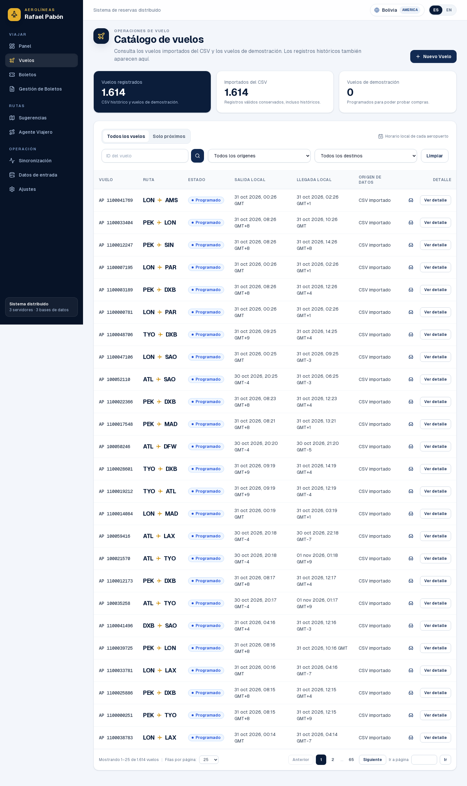

### Compra: selección de asiento y datos del pasajero
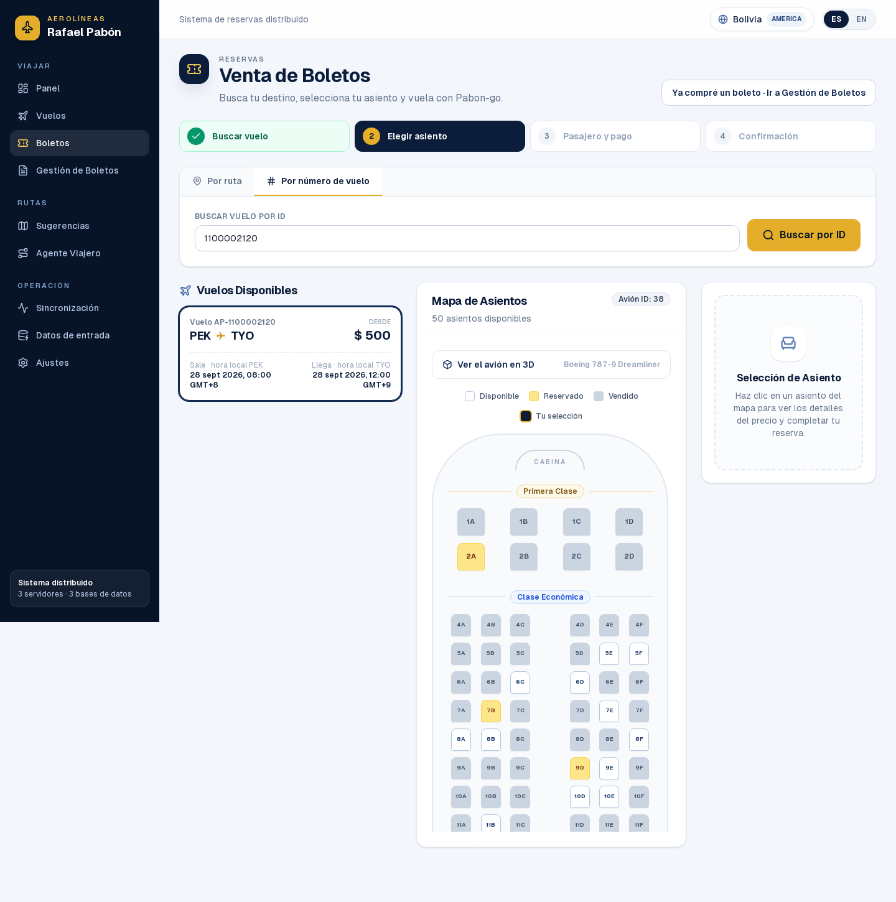
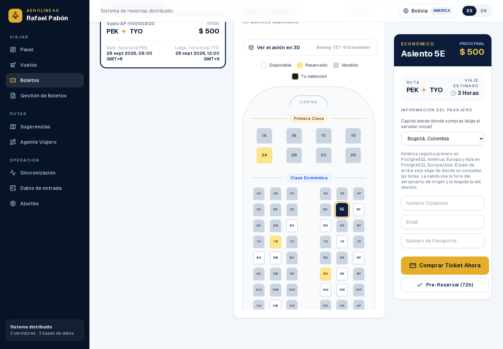

### Gestión de boletos y pase de abordar
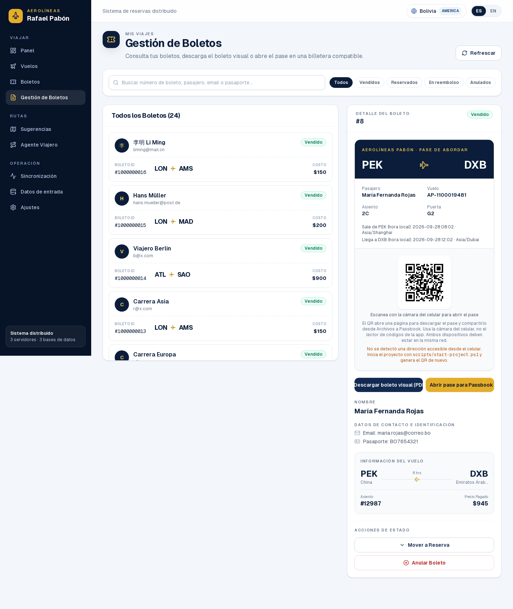

### Rutas sugeridas (Dijkstra, 3 mejores rutas)
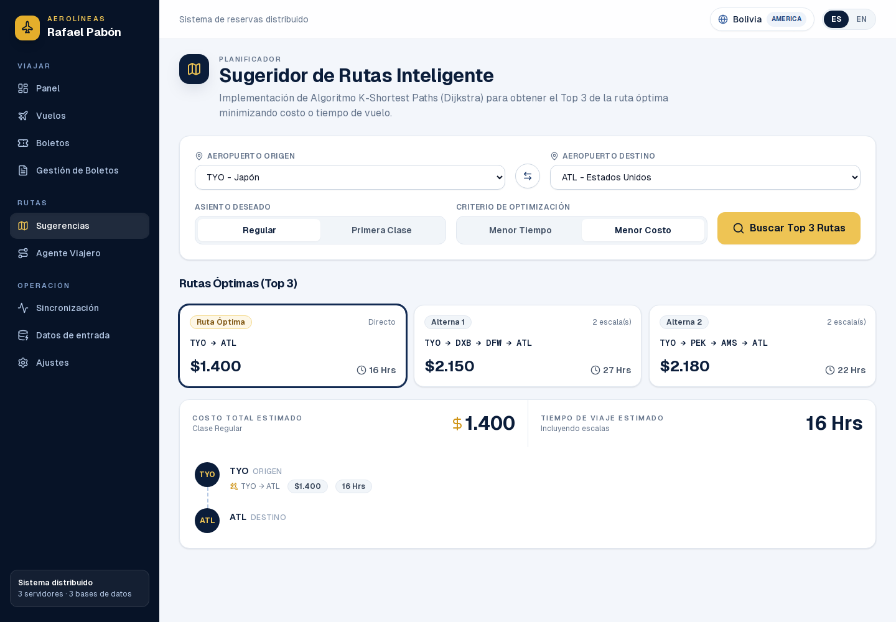

### Agente viajero (TSP)
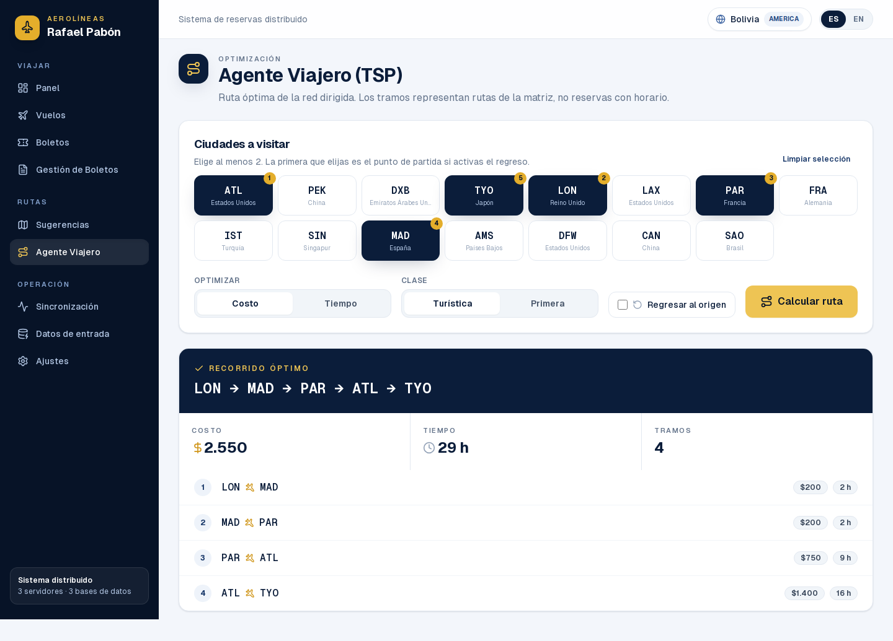

### Sincronización: servidores, relojes y bases
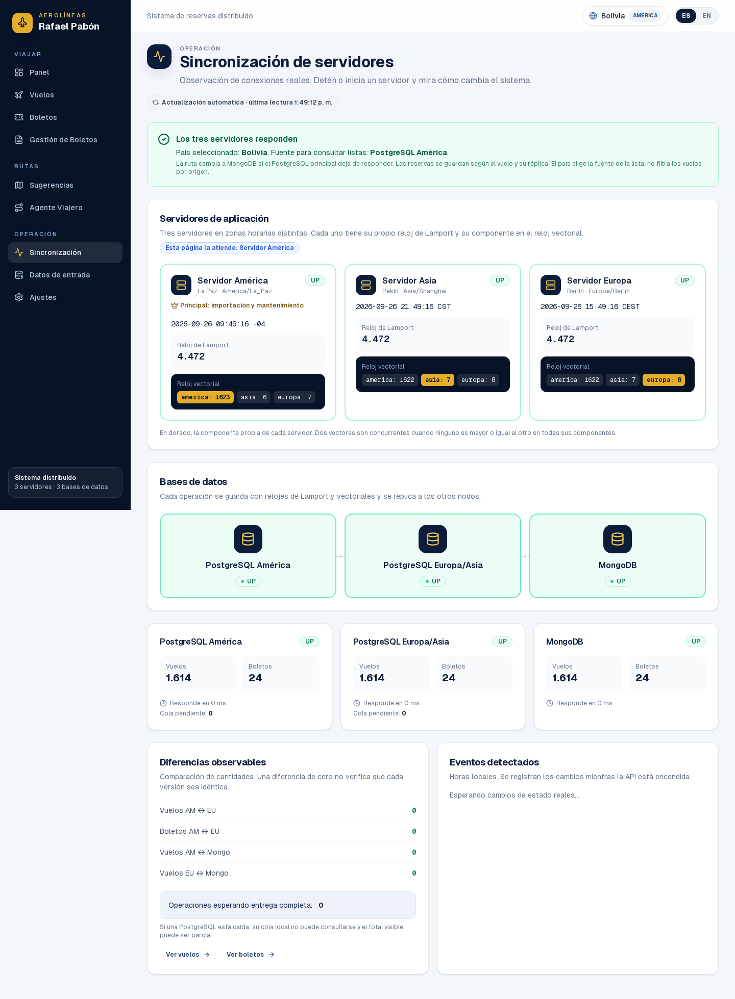

### Panel de un vuelo
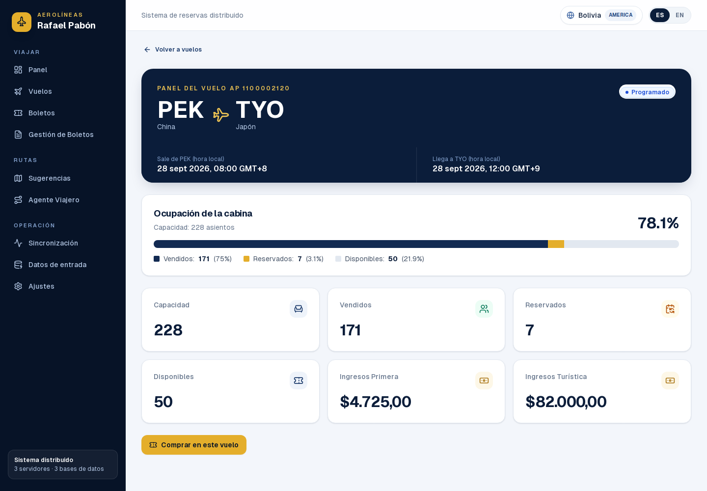

### Datos de entrada
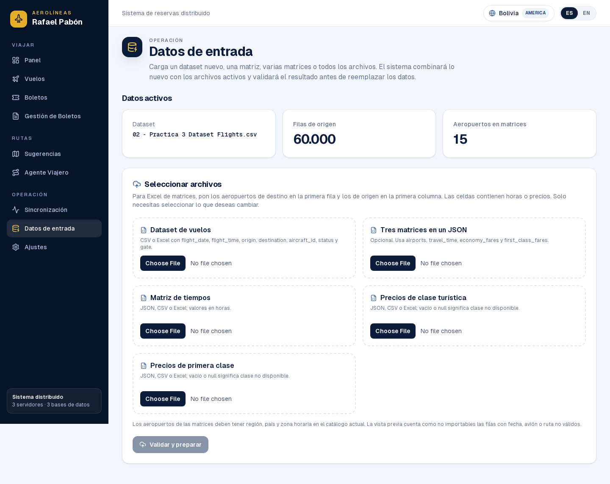

### Multiidioma (inglés) y versión móvil
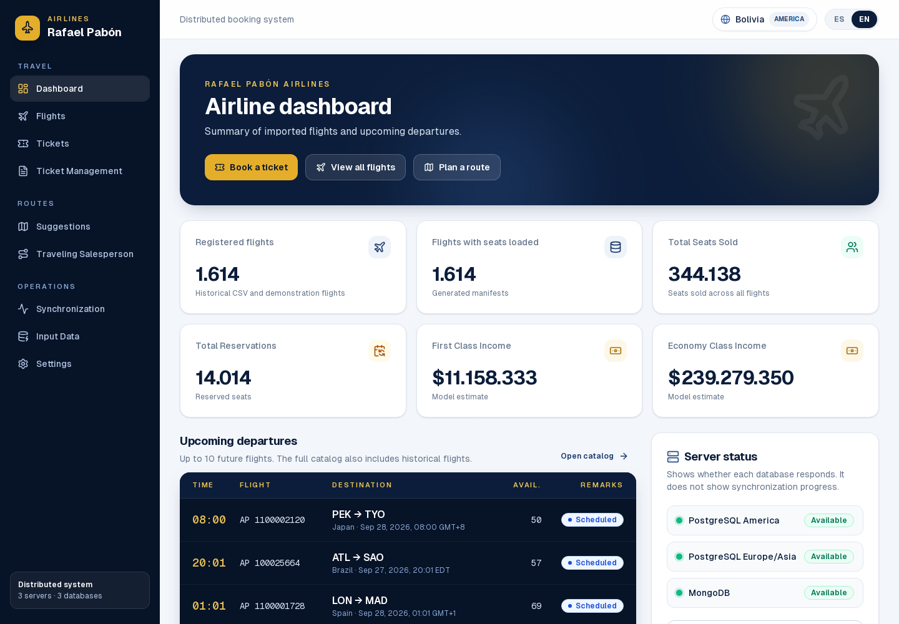
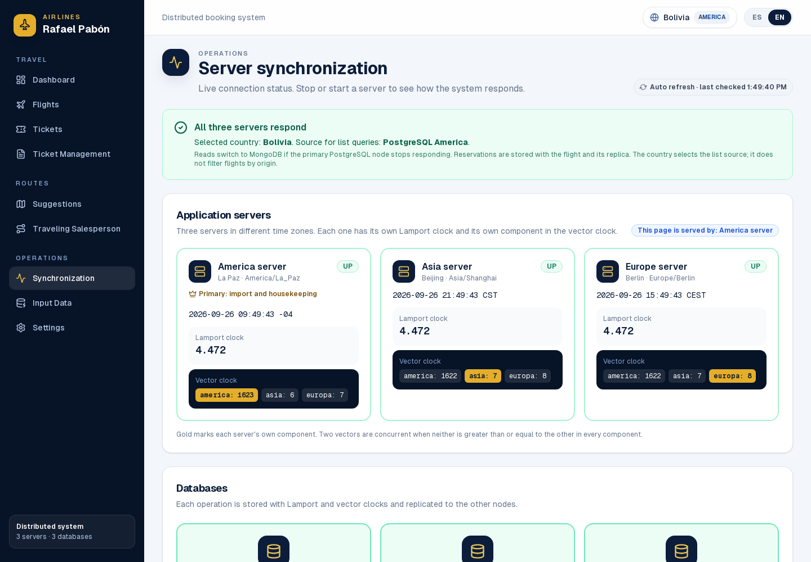
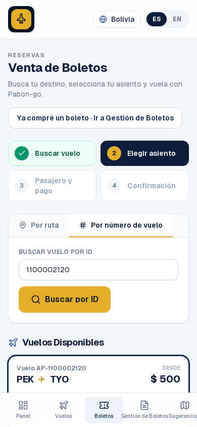

## Cómo repetir las pruebas

```bash
docker compose up -d --build
cd backend && go test ./...          # o dentro de Docker: docker run --rm -v "$PWD":/src -w /src golang:alpine go test ./...
curl http://localhost:8080/api/cluster
curl http://localhost:8080/api/diagnostico/continuidad
docker compose stop backend_as       # caída de un servidor; luego: docker compose start backend_as
docker compose stop postgres_eu      # caída de una base; luego: docker compose start postgres_eu
```

La guía paso a paso desde la interfaz está en [demo-sincronizacion.md](demo-sincronizacion.md).
